# 教室で使えるかもしれないもの作り #◯ 「だれが出してないんだっけ」を数えなくていい。がんばりが経験値でたまる学習記録アプリ「まなびクエスト」

## 🏫 はじめに

宿題や課題を出したあと、だれが出していないかを名簿と見くらべながら数えている時間。あれ、けっこう長いのではないでしょうか。

丸をつける作業そのものより、「出した子」と「まだの子」を分けるところに手間がかかります。しかも次の日にはまた新しい提出物が来るので、数え直しになります。

そのいっぽうで、子どものほうにも困りごとがあります。がんばって計算アプリをやっても、家で本を読んでも、それは先生には見えません。見えないものは、ほめようがありません。ほめられないと、続ける理由が本人の意志だけになってしまいます。

まなびクエストは、この二つを同じ場所でつなごうとして作ったものです。子どもは学習アプリで遊んだきろくを送るだけで経験値がたまり、先生の画面には提出率と「気になる子」が自動で並びます。丸をつける作業はありません。

配るURLはこれひとつです。

https://gamification.giga-school.com/

この連載では、これまでも計算や漢字の学習アプリを紹介してきました。まなびクエストは、それらのアプリが残したきろくを受け取って、ひとつの成長として見せるための土台にあたります。単体でも使えますが、学習アプリといっしょに使うといちばん力を出します。

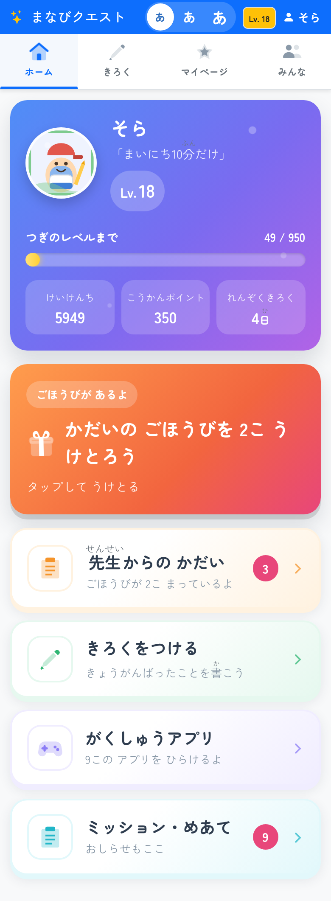

トップページ。名前とレベル、次のレベルまでの残り、経験値、連続きろく日数が一画面におさまっています。

## 📱 このアプリでできること

まず、子どもが開いたときの話から書きます。

その日はじめて開くと、ログインボーナスが出ます。何もしていなくても、来ただけで少しもらえます。小さなことですが、「まず開く」という習慣ができないと、あとの機能は全部ないのと同じになってしまいます。

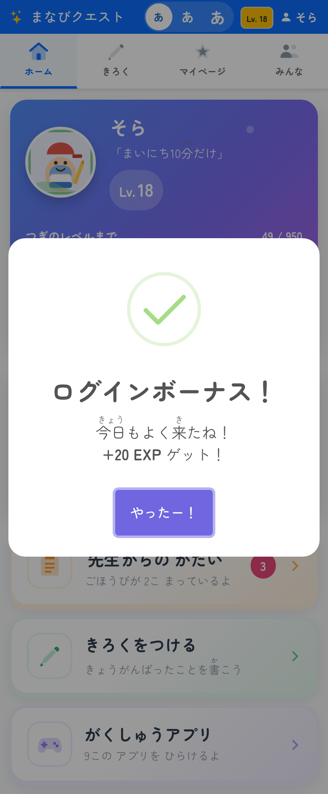

その日はじめて開いたときのごほうび。もらえる量は先生が変えられます。

ホームには、えらべるものを多くて四つまでしか置いていません。かだい、きろくをつける、がくしゅうアプリ、ミッションとめあて。この四つです。上のほうに「きょういちばんやってほしいこと」がひとつだけ出るので、迷った子はそこを押せば進めます。

えらぶものが五つ以上ならぶと、低学年の子はそこで止まります。だから奥に入る階段を作って、一段ごとに三つまでにしました。かわりに階層は深くなるので、どの画面からでも一回で前にもどれるボタンを必ず置いています。

ここからは、書くきろくの話です。きろくは五種類あります。せいちょうのきろく、じしゅ学習、じゅぎょうのふり返り、テストのふり返り、どうとくノートです。

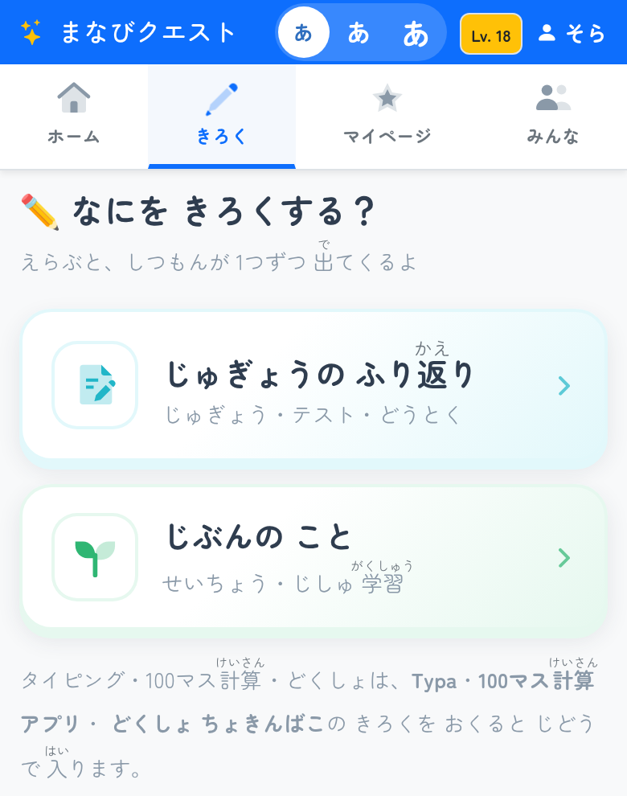

じゅぎょうのふり返りと、じぶんのこと。まず二つに分けています。

大事にしたのは、長いフォームを一枚で見せないことです。しつもんが六つならんだ画面を出すと、子どもは書く前に「多い」と感じてしまいます。そこで、一画面にしつもんをひとつだけ出して、答えたら次に進む形にしました。

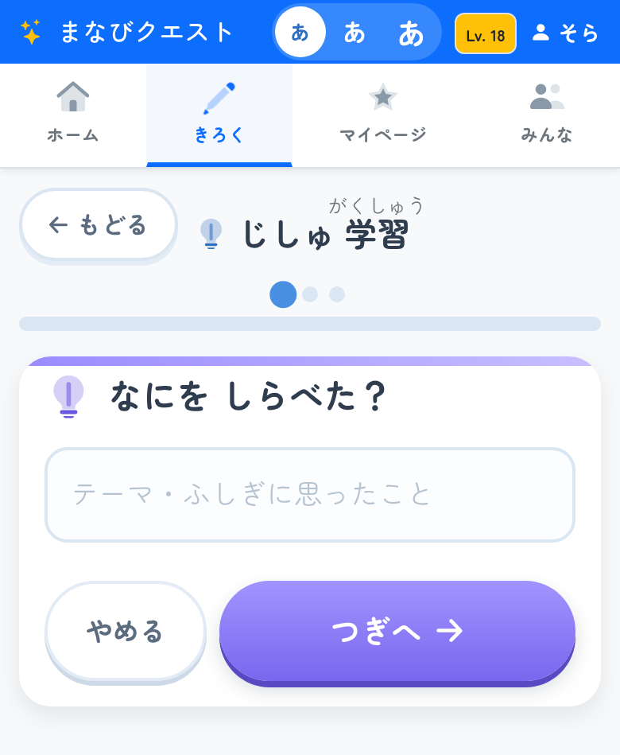

じしゅ学習の一問目。上の点が、あと何問かを表しています。

書き出しに困る子のために、「しらべてみると」「おどろいたのは」「まとめると」といった書き出しのヒントを置きました。押すと入力欄に入ります。何も浮かばないときの最初の一文字を、こちらで用意しておくためのものです。

書き終わると、その場で経験値が入ります。あとでまとめて処理するのではなく、押した瞬間に返します。

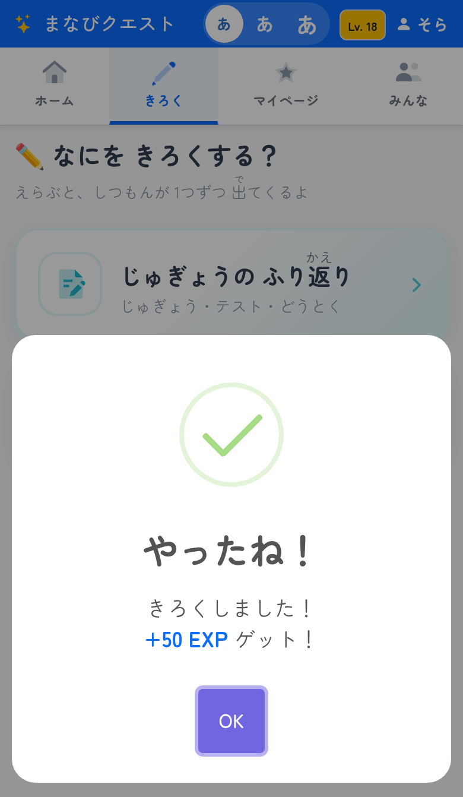

保存すると、その場で経験値が入ります。

続けたことが見えないと、続ける気持ちは細ります。そこで、たまったものを何通りかの見せ方で出しています。

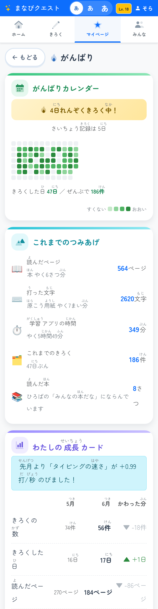

きろくした日が濃い色になるカレンダーと、これまでのつみあげ。読んだページ数は「本やく何さつ分」、打った文字数は「原こう用紙やく何まい分」に言いかえています。

数字をそのまま出しても、子どもには大きさが伝わりません。564ページと言われるより、本やく6さつ分と言われるほうが手ざわりがあります。学習アプリの時間も、349分ではなく「やく5時間49分」と書きました。

先月と今月をならべる成長カードも入れています。増えた項目には上向きの印、減った項目には下向きの印が出ます。減っていることも隠さずに出すようにしました。増えたところだけ見せると、次に減ったときに嘘になってしまうからです。

条件を満たすともらえるバッジは、最初から26種類あります。もらえていないものも灰色でならべてあります。何があるのか分からないと、ねらいようがないためです。

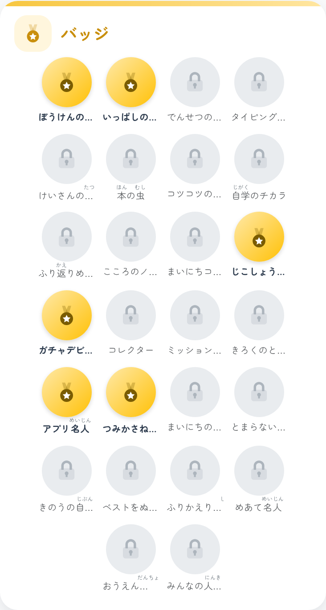

26種類のバッジ。灰色はまだもらえていないものです。

ミッションはデイリー、ウィークリー、クラス協力の三種類で、最初から16件入っています。中身も報酬もシートの上で書きかえられるので、学級の実態に合わせて作り直せます。

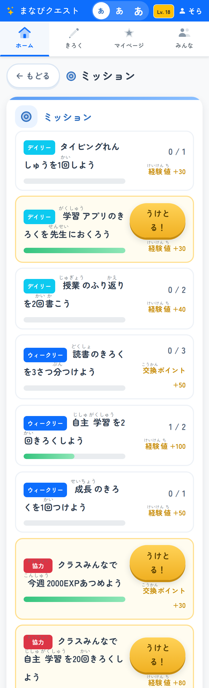

デイリーとウィークリーのミッション。クラス全員で達成するものもあります。

たまった経験値は、ガチャに使えます。当てたアイテムでアバターを着せかえられて、同じものが重なったときは交換ポイントになります。

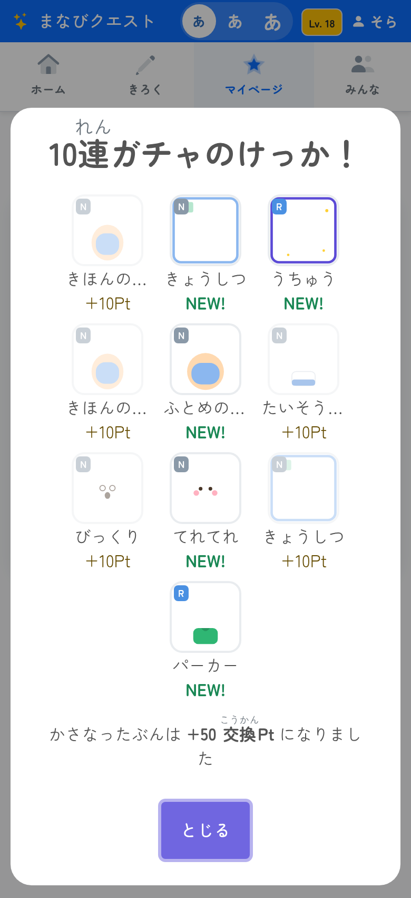

10連ガチャの結果。重なったぶんは交換ポイントになります。

ここは正直、学習そのものとは関係がありません。それでも入れたのは、「使いみちのない点数」はすぐに飽きられるからです。ためたものを使う場所があると、ためること自体が続きやすくなると思っています。

学習の記録は、放っておくとひとりの作業になります。それだと、続く子と続かない子の差がそのまま開いていきます。

そこで、友だちに応援スタンプを送れるようにしました。自由に文章を書けるようにはしていません。書けるようにすると、必ず何かが起きるからです。定型のスタンプだけにして、一日に送れる数も五回までにしています。

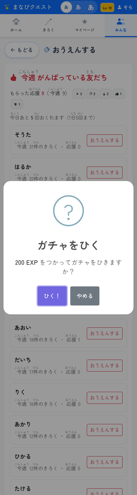

今週がんばっている友だちがならびます。送れるのは定型のスタンプだけです。

クラス全員で達成する共同目標のゲージもあります。自分が一件きろくすると、クラスのゲージがその分だけ伸びます。ひとりで進まない日でも、だれかが進めてくれます。

読めなければ使えない、というところにも手を入れました。児童画面の漢字には、自動でふりがなが付きます。あらかじめ用意した文だけでなく、友だちが書いたふり返りや本のタイトルにも付きます。

文字の大きさも、画面の右上で三段階に切りかえられます。低学年の教室や、見えにくい子のいる教室で最初につまずくのはここだと思っています。

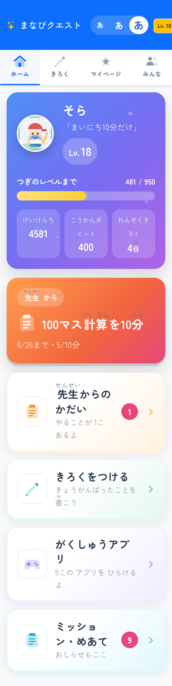

いちばん大きい設定にしたところ。画面ぜんぶが同時に大きくなります。

## 🎮 学習アプリのきろくが、そのまま経験値になる

まなびクエストのいちばんの持ち味は、ここだと思っています。

ホームの「がくしゅうアプリ」を開くと、この連載で紹介してきた学習アプリが9本ならびます。教科のラベルと、ひとこと説明つきです。押すと新しいタブで開きます。

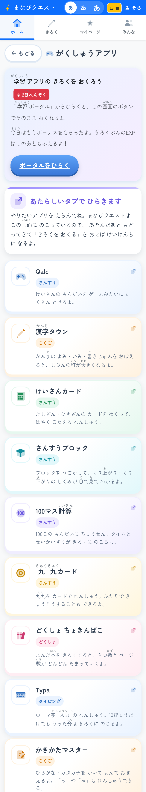

Qalc、漢字タウン、けいさんカード、さんすうブロック、100マス計算、九九カード、どくしょ ちょきんばこ、Typa、かきかたマスターの9本。

新しいタブで開くので、まなびクエストは開いたまま残ります。あそんだあと、そのタブにもどって「きろくを おくる」を押せば、それが経験値になります。あそぶ、もどる、おくる。この三つが一か所でつながります。

ここでひとつ、どうしても分かれてしまう事情があります。学習アプリが端末にためたきろくは、同じ住所のページからしか読み出せない決まりになっています。まなびクエストの本体は Google のサーバーにあるので、住所がちがいます。

そこで、学習アプリと同じ住所に「学習ポータル」という薄いページを置いて、その中にまなびクエストを丸ごと表示する形にしました。子どもから見ると、ポータルを開くだけで全部つながって見えます。

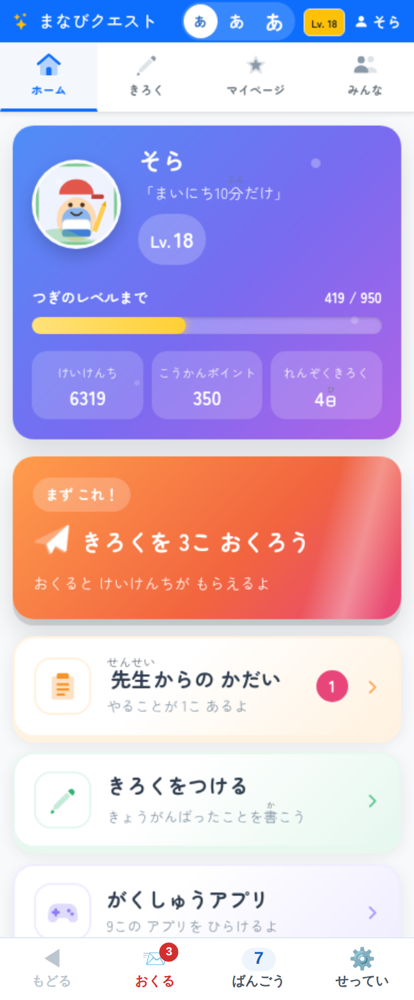

学習ポータルで開いたところ。画面のほとんどをまなびクエストが使い、下に四つのボタンがならびます。

下のボタンの「おくる」の右上にある数字が、まだ送っていないきろくの数です。押すと、たまっていたものがまとめて届きます。

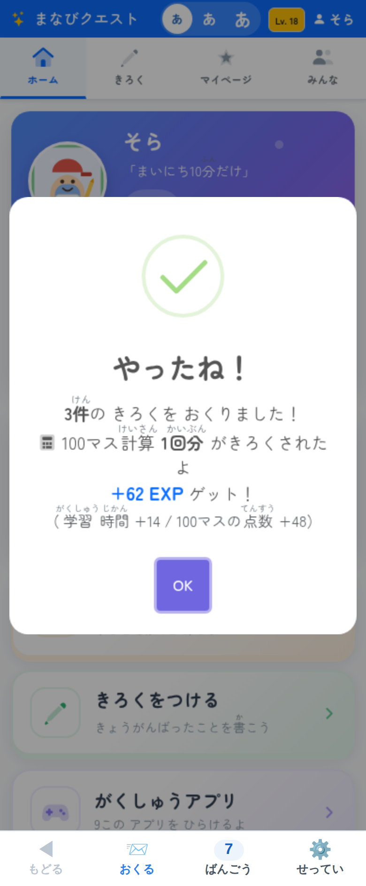

三件まとめて送ったところ。100マス計算のきろくは、専用のシートにも自動で転記されます。

送ったきろくは、先生の画面では「学習アプリのとりくみ」にまとまります。児童ごとの回数、学習時間、初回正答率、最後に学習した日がならびます。

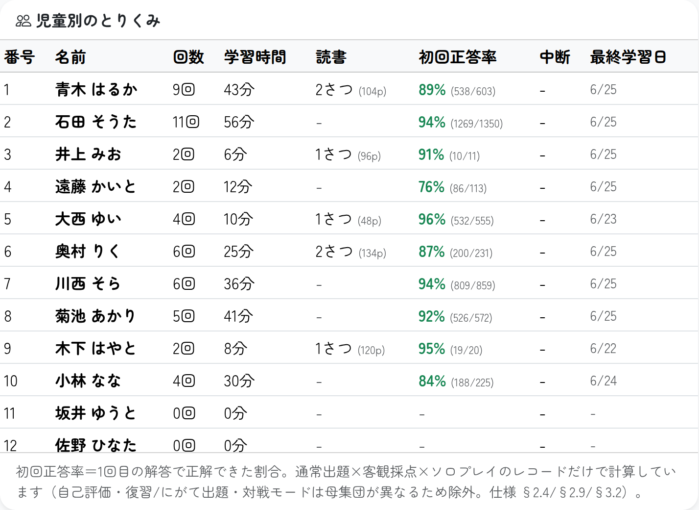

児童別の一覧。初回正答率は、一回目の解答で正解できた割合です。

初回正答率という言い方にこだわりました。何回もやり直したあとの正答率は、たいてい100パーセントに近づきます。それでは「分かっているのか」が見えません。一回目でどうだったかだけを見ると、そこが見えてきます。

そして、この画面にはもうひとつ出るものがあります。クラスのつまずき問題です。

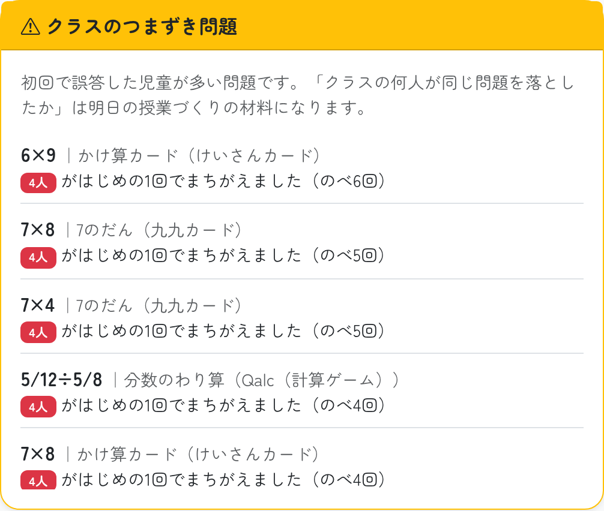

初回で誤答した子が多かった問題。何人が同じ問題を落としたかが出ます。

「6かける9で四人が落とした」と分かると、明日の授業でどこに時間を使うかが決まります。個人の点数を見るより、こちらのほうが授業づくりに効くと思ってこの形にしました。

読書だけは、時間ではなく冊数とページ数で見るようにしています。読書アプリが測っているのは「一冊を記録する操作」にかかった時間で、読んでいた時間ではないからです。ここを学習時間に足すと、数字が嘘になります。

## ✅ 課題を出すと、提出率がひとりでに出てくる

先生の画面から、課題を出せます。出せるのは二種類です。学習アプリでやるものと、まなびクエストの中に書くきろくです。

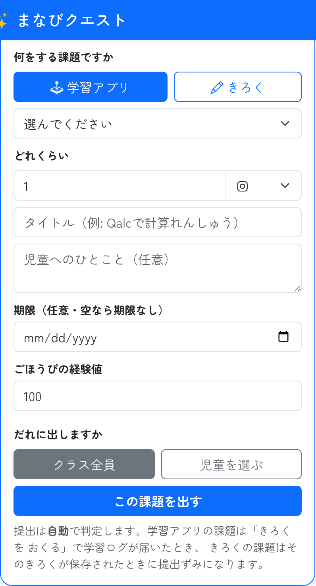

課題を出すところ。目標の数、期限、ごほうびの経験値、だれに出すかをえらびます。

宛先はクラス全員でも、児童をえらんで個別でも出せます。「この子にはこれを」という出し方ができます。

子どもの画面には、かだいのカードとして届きます。学習アプリの課題ならそのままアプリを開くボタンが、きろくの課題ならフォームへ行くボタンが付いています。

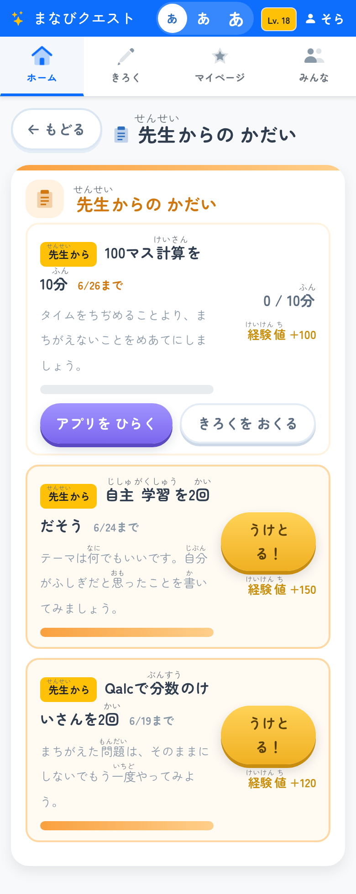

子どもの画面に届いたかだい。今の進みぐあいと、もらえる経験値が出ます。

やり切ると「うけとる！」が押せるようになります。押すとごほうびの経験値が入ります。

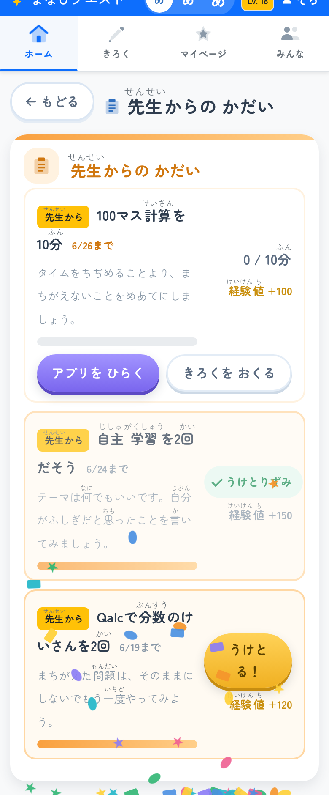

条件を満たすと「うけとる！」が押せます。押すと、うけとりずみに変わります。

さて、先生のほうです。提出したかどうかは、先生が入力しません。学習ログときろくから毎回みちびいています。

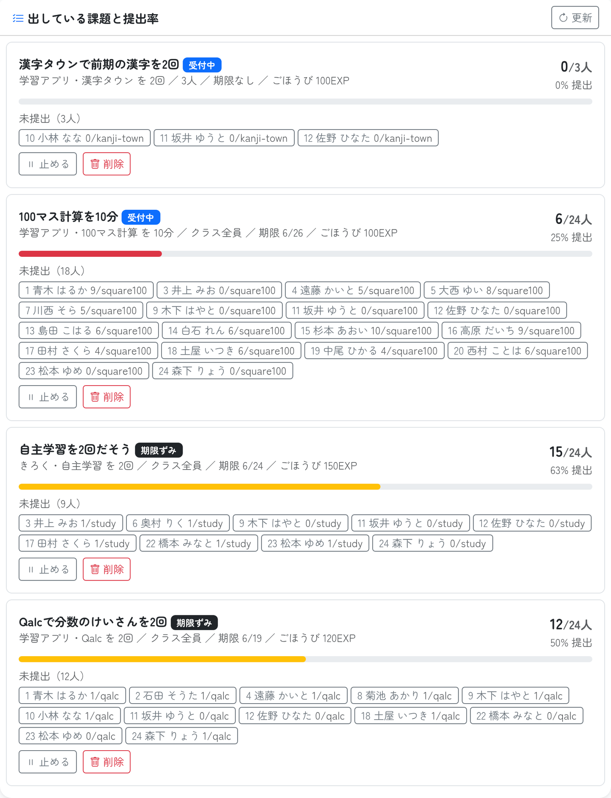

課題ごとの提出率と、まだ出していない子の名前。名前の横の数字は、その子の今の進みぐあいです。

24人のうち15人、63パーセント提出。そんなふうに出て、その下に未提出の子の名前がならびます。しかも名前の横には、その子が今どこまで進んでいるかの数も出ます。まったく手をつけていない子と、あと一回で終わる子は、声のかけ方が変わるはずです。

児童と課題を組み合わせた一覧も出ます。

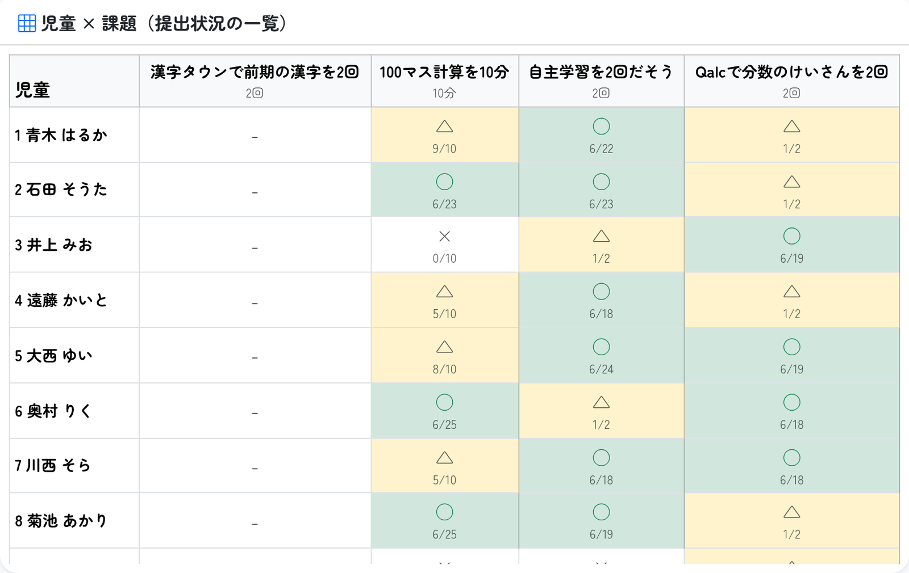

たてが児童、よこが課題。丸が提出ずみ、三角が途中です。

提出をどこにも保存していないので、あとから目標の回数や期限を直しても、判定はその場で追いつきます。「やっぱり三回を二回にしよう」と思ったときに、数え直しが起きません。

そして、期限をすぎた未提出がたまっている子は、ダッシュボードの声かけリストに自動でならびます。

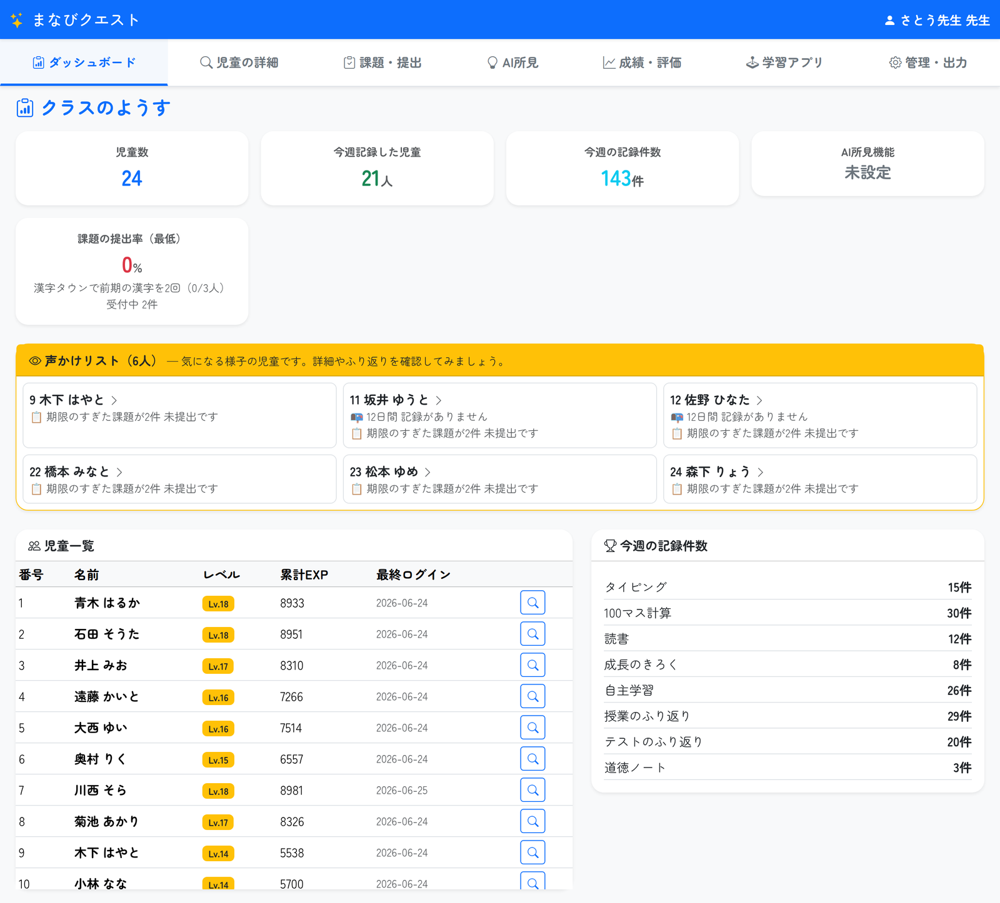

クラスのようす。声かけリストには、記録が止まっている子と、未提出がたまっている子が出ます。

このリストに出る理由は二つです。何日も記録がないこと。期限をすぎた未提出がたまっていること。何日でリストに出すかは、先生が変えられます。

しずかにしている子ほど、忙しい日には見落とされます。名簿を見て気づくのではなく、機械のほうから名前を出してくれると、気づける確率は上がると思います。

テストのふり返りは、成績の一覧にもなります。

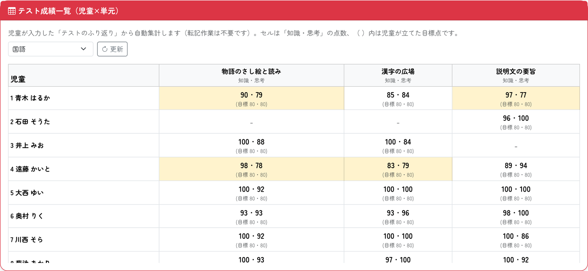

児童と単元をかけあわせた成績の表。かっこの中は、その子が自分で立てた目標点です。

子どもが入力したものがそのまま集計されるので、先生が転記する作業はありません。目標点にとどかなかったところには色が付きます。

所見づくりの下ごしらえもできます。授業の単元名とねらいを登録しておくと、子どものふり返りを照らし合わせて所見の材料をためていく仕組みです。

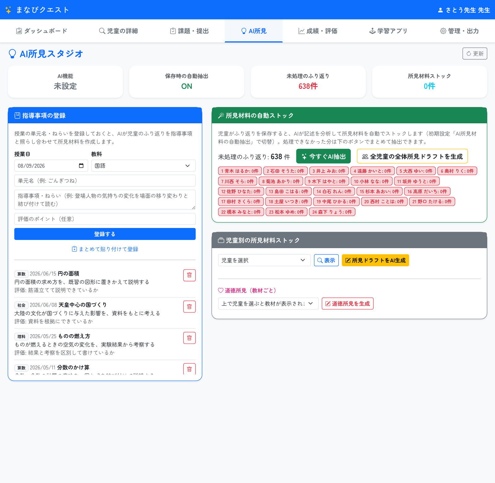

指導事項を登録しておくところ。AIの鍵を入れていないときは、画面の上に未設定と出ます。

ここだけは、Gemini というサービスの鍵を用意したときだけ動きます。鍵がなくても、ほかの機能はすべて動きます。画面の上に未設定と出るので、動いていないことが分かるようにしました。動いていないのに黙っているのがいちばんこわいので、そこは必ず出すようにしています。

## ✨ 導入のメリット

三つのいいことが期待できます。

一つ目は、数える時間がなくなることです。だれが出していないかを名簿と見くらべる作業が要らなくなります。提出は記録からみちびいているので、目標の回数や期限を直しても数え直しになりません。その時間を、まだ出していない子に声をかけるほうに回せると思います。

二つ目は、見えなかったがんばりが見えることです。家でやった計算アプリも、休み時間に読んだ本も、ふだんは先生に届きません。それがきろくとして届くようになると、ほめる材料が増えます。ほめる材料が増えると、ほめられる子が増えます。テストの点数が高い子だけがほめられる状態から、少しだけ動かせるのではないかと思っています。

三つ目は、気になる子に早く気づけることです。声かけリストは、記録が止まっている子と、未提出がたまっている子を毎日ひろい上げます。忙しい週ほど見落としは増えますが、機械のほうから名前を出してくれるなら、その週も気づけます。授業のことで頭がいっぱいの日に、いちばん助かるのはここだと思っています。

## 🛠️ 【管理者向け】導入手順

情報担当の先生に確認されそうなことを、先に書いておきます。

必要なものは、Google のスプレッドシート一枚と、そこに貼り付けるプログラムです。それ以外のサーバーは要りません。データはすべて、その一枚のスプレッドシートの中に入ります。学校の外にデータを置く場所は増えません。

学校のアカウントに制限があって、公開の設定で「全員」がえらべないことがあります。そのままで使えるように作ってあります。組織内のままでかまいません。

校内のフィルタリングで許可が必要になるのは、子どもに配るページの gamification.giga-school.com、まなびクエスト本体が動く script.google.com、そしてその中身が表示される script.googleusercontent.com です。学習アプリはそれぞれ別のアドレス（kanji-town.giga-school.com のように、アプリごとの giga-school.com のサブドメイン）にあるので、使うアプリのぶんもあわせて許可してください。一覧は https://giga-school.com/filtering/ にまとめてあります。

個人情報の扱いも書いておきます。子どもに配るページのほうは、名前もメールアドレスも持ちません。だれのきろくかは、ログインしているアカウントから本体が判断しています。共用の端末で前の子の出席番号が残っていても、取りちがえは起きません。

学習アプリのきろくには、名前も出席番号も入っていません。何時何分に学習したかも、標準では残しません。午前、午後、夕方以降の三つにまるめて保存します。細かい時刻まで残すと、夜おそくに使っていたことまで先生に見えてしまうからです。必要な学級では、分まで残す設定にも変えられます。

設定は、先生が最初に一回だけ入れます。

1. 子ども用の端末か先生の端末で、ポータルのページを開く
2. 画面の下の「せってい」を押す
3. いちばん上の欄に、まなびクエスト本体のアドレスを貼る
4. 「保存する」を押す
5. 「接続テスト」を押して、本体経由でおくれると出ることをたしかめる

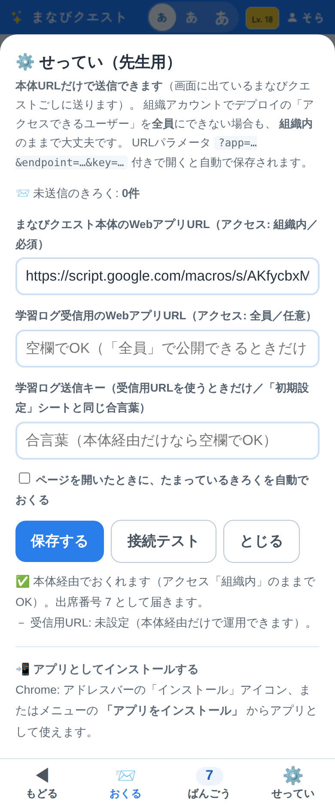

せっていの画面。接続テストを押すと、だれとして届くかまで出ます。

接続テストの結果には、いま開いているアカウントが何番として届くかも出ます。先生のアカウントで試したときは「児童マスタにありません」と出ますが、それが正常です。先生は名簿の児童ではないからです。

設定を入れたURLを、そのまま子どもに配らないでください。子どもの端末では、先生がこの画面から入れてください。

共用端末で使うときは、もうひとつだけ気をつけることがあります。せっていの中身はその端末の中だけに保存されるので、先生の設定を入れたまま貸し出さないようにしてください。

端末ごとの癖も書いておきます。iPad の Safari は、七日間そのサイトを開かないと保存した内容を消すことがあります。長い休みの前には、「おくる」を押してから終わるようにしてください。ホーム画面に追加しておくと消されにくくなります。

Chromebook は、メモリが足りなくなると開きっぱなしのタブを黙って閉じます。タブを開きっぱなしにしないほうが確実です。

ホーム画面への追加は、iPhone と iPad なら Safari の共有ボタンから「ホーム画面に追加」です。Safari 以外では出ません。Android と Chromebook と Windows は、画面の下に出てくる案内バーか、アドレスバーのインストールのアイコンから入れられます。入れておくと、ブラウザのタブを探さなくてよくなります。

## 📖 【利用者向け】使い方のガイド

子どもの一日の流れです。この五つだけ覚えてもらえば動きます。

1. 配られたURLを開く。ホーム画面に入れてあるなら、そのアイコンを押す
2. 「がくしゅうアプリ」から、やりたいアプリをえらんで開く。新しいタブで開きます
3. あそび終わったら、まなびクエストのタブにもどる
4. 画面の下の「おくる」を押す。右上の数字が、まだ送っていないきろくの数です
5. 経験値がたまって、レベルが上がる

きろくを自分で書くときは、こうします。

1. 上の「きろく」をタブから開く
2. 「じゅぎょうの ふり返り」か「じぶんの こと」をえらぶ
3. 書きたい種類をえらぶ
4. しつもんに一つずつ答えて、「つぎへ」で進む
5. 最後に「きろくする」を押す

先生が課題を出すときは、こうします。

1. 先生のアカウントでポータルを開く。教員用の画面が出ます
2. 上の「課題・提出」をえらぶ
3. 学習アプリかきろくかをえらび、どのアプリ、どのきろくかをえらぶ
4. 目標の数と単位を入れる。学習アプリなら回か分をえらべます
5. タイトルと、期限と、ごほうびの経験値を入れる
6. クラス全員か、児童をえらぶかを決める
7. 「この課題を出す」を押す

出したあとは、同じ画面の下に提出率がならびます。丸をつける作業はありません。未提出の子の名前を押すと、その子の記録の画面に行けます。

うまくいかないときは、まず画面をとじて、もう一度ひらいてください。これでたいてい直ります。それでも直らないときは、せっていの接続テストを押して、赤い印が出ていないかをたしかめてください。

きろくは送れるまで端末に残ります。押しても消えることはないので、そこは安心してください。

## 📝 まとめ

このアプリを作りながら、ずっと考えていたことがあります。

先生の時間が足りないのは、たぶん、やることが多いからではありません。数える、写す、そろえる。そういう「本当は人がやらなくてもいいこと」に時間が溶けているからだと思います。提出物を数える時間は、その代表格ではないでしょうか。

そこが減ったぶんの時間を、何に使うか。それは効率を上げることではなくて、子どもの顔を見ることに使えたらいいと思っています。「三日きろくが止まっているな」と気づいて、廊下で一声かける。そのくらいのことが、いちばん効くような気がしています。

子どもの側にも同じことが言えます。がんばりが数になって見えるのは、順位をつけるためではありません。「自分は続けられている」と自分で確かめるためです。カレンダーの色が濃くなっていくのを見て、明日も開こうと思ってくれたら、それでいいと思っています。

まなびクエストは、そういう時間を少しだけ作るための道具のつもりで作りました。これで教室が変わるとは思っていません。でも、名簿を見くらべる十分が、子どもと話す十分に変わるなら、それは作った意味があると思います。

もしよかったら、まずは先生ご自身の端末で開いてみてください。スプレッドシート一枚から始められます。合わないと思ったら、シートを消すだけで元にもどります。

一歩踏み出そうとする先生を、私はいつでも全力で応援しています。
